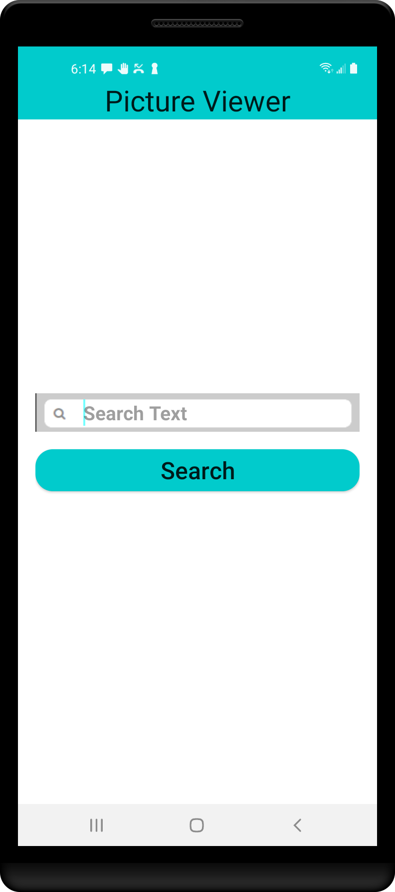
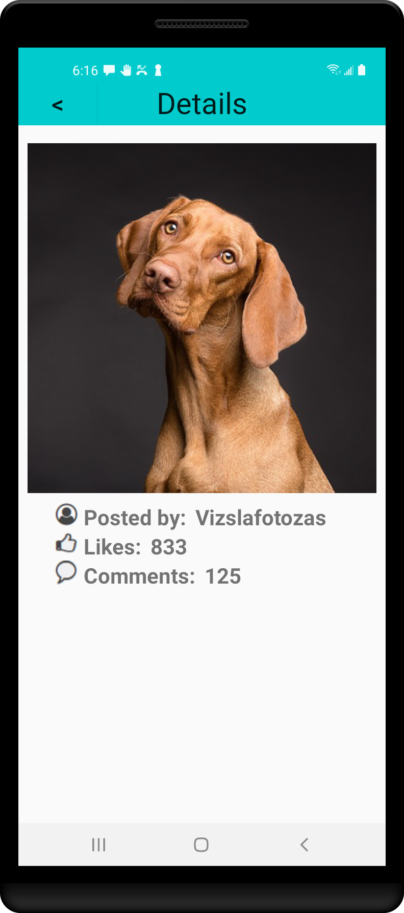

 

## Pixabay Image Viewer for Android in Kotlin MVVM

Coded in 2022, this is a rewrite of my **[ImageViewer](https://github.com/JanusCole/ImageViewer)** using Kotlin and the MVVM architecture with Jetpack Navigation.

In this repo you'll find:
* A single-activity architecture employing **[JetPack Navigation](https://developer.android.com/guide/navigation/)**.
* A single image search fragment employing the **[Model-View-Presenter](https://www.raywenderlich.com/7026-getting-started-with-mvp-model-view-presenter-on-android)** design pattern.  
* Two reactive user interfaces built with **[ViewModels](https://developer.android.com/topic/libraries/architecture/viewmodel)** and **[Data Binding](https://developer.android.com/topic/libraries/data-binding/)**.
* Consumption of a REST api, using Square's **[Retrofit2](https://square.github.io/retrofit/)** library.
* Image loading with Square's **[Picasso](https://square.github.io/picasso/)** library.

### Screen Shots

<tr>
<td>

</td>
<td>

</td>
<td>

</td>

</tr>

### Running the app in Android Studio

In order to run the code, you'll need to get an api key from [Pixabay](https://pixabay.com/service/about/api/) and store it in an environment variable on your system called PIXABAY_APIKEY. 